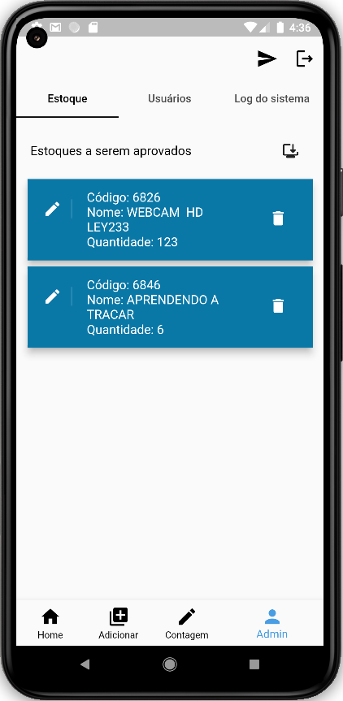

# Contagem de Estoque Gestão Click

Um projeto de Flutter que auxilia a contagem de estoque de uma empresa que utiliza o sistema da Gestão Click.

## Sobre o Projeto
O projeto foi criado com o intuito de descentralizar a contagem de estoque do administrador, possibilitando que os funcionários participem do processo de cadastro no estoque. Assim, o administrador estará livre para resolver outros assuntos da empresa, enquanto mantém o estoque da loja atualizado. 

Para utilizar o sistema, o usuário deve entrar com sua conta do Google e, caso tenha o acesso concedido pelo administrador, poderá começar a fazer a contagem de estoque.

Tela de Login            |  Tela inicial
:-------------------------:|:-------------------------:
 | 

Abaixo está a tela de cadastro, onde o funcionário terá acesso para registrar o estoque de um dos produtos. Ele poderá adicionar ou alterar o estoque de algum produto. Após fazer a contagem, ele deverá enviar a lista criada para o administrador, que decidirá se o estoque do vendedor entrará para o sistema da Gestão Click ou se será excluído, como visto abaixo.

Tela de Cadastro           |  Tela do Administrador
:-------------------------:|:-------------------------:
 | 

Além disso, na tela do administrador, ele poderá dar privilégios para novos usuários ou verificar o log dos produtos enviados pelos funcionários, para manter o controle do que foi atualizado.

## Como utilizar o aplicativo para sua empresa

Para utilizar o aplicativo em sua empresa, é necessário criar uma base de dados no sistema Firebase e fazer a conexão com o aplicativo. Além disso, para fazer a conexão com a API da Gestão Click, é importante criar na pasta 'lib/persistence' um arquivo .dart com os tokens de acesso disponibilizados pelo sistema da Gestão Click.
